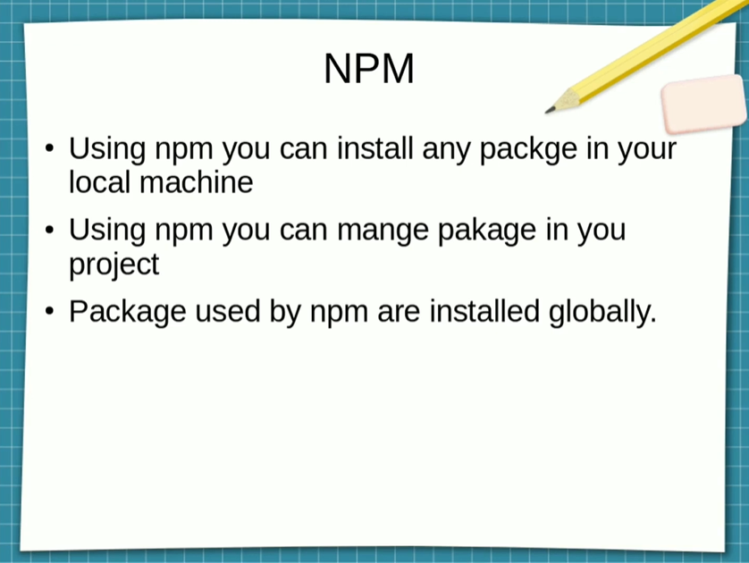
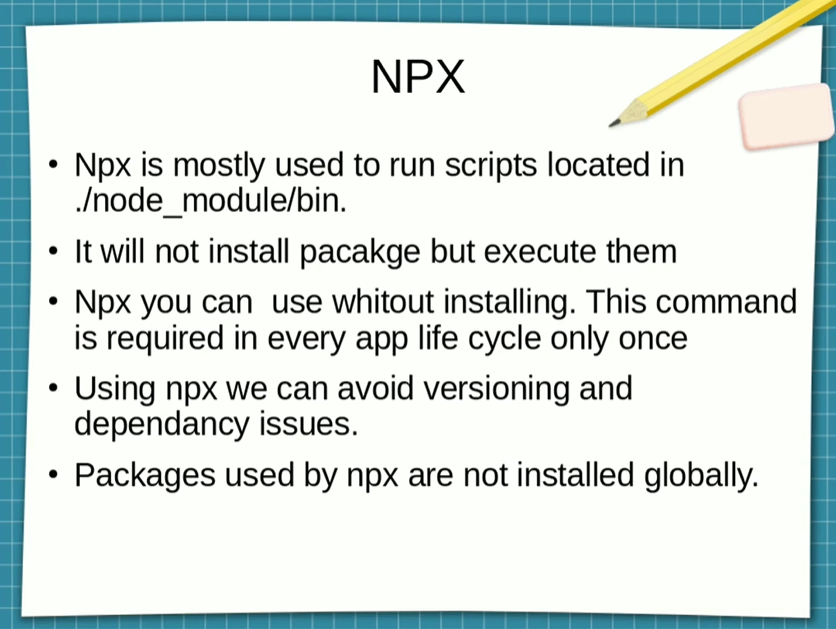

# Complete React Developer in 2020 (w/ Redux, Hooks, GraphQL) Live Study Guide

## Table of Contents

-   [Complete React Developer in 2020 (w/ Redux, Hooks, GraphQL) Live Study Guide](#complete-react-developer-in-2020-w-redux-hooks-graphql-live-study-guide)
    -   [Table of Contents](#table-of-contents)
    -   [**Section 2: React Key Concepts**](#section-2-react-key-concepts)
        -   [React Concepts](#react-concepts)
        -   [How To Be A Great React Developer](#how-to-be-a-great-react-developer)
    -   [**Section 3: React Basics**](#section-3-react-basics)
        -   [Section Overview](#section-overview)
        -   [NPM vs YARN](#npm-vs-yarn)
        -   [NPM vs NPX](#npm-vs-npx)
    -   [**Section 4: Master Project: Setting Up E-commerce Project**](#section-4-master-project-setting-up-e-commerce-project)
    -   [**Section 5: Master Project: React Router and Routing**](#section-5-master-project-react-router-and-routing)
    -   [**Section 6: Master Project: Forms + Components**](#section-6-master-project-forms--components)
    -   [**Section 7: Master Project: Firebase + User Authentication**](#section-7-master-project-firebase--user-authentication)
    -   [**Section 8: Master Project: Redux 1**](#section-8-master-project-redux-1)
    -   [**Section 9: Master Project: Session Storage + Persistence**](#section-9-master-project-session-storage--persistence)
    -   [**Section 10: Master Project: Redux 2**](#section-10-master-project-redux-2)
    -   [**Section 11: Master Project: Advanced Routing**](#section-11-master-project-advanced-routing)
    -   [**Section 12: Master Project: State Normalization**](#section-12-master-project-state-normalization)
    -   [**Section 13: Master Project: Stripe Payments Part 1**](#section-13-master-project-stripe-payments-part-1)
    -   [**Section 14: Master Project: Deploying To Production**](#section-14-master-project-deploying-to-production)
    -   [**Section 15: Master Project: CSS in JS - styled-components**](#section-15-master-project-css-in-js---styled-components)
    -   [**Section 16: Master Project: Advanced Redux + Firebase**](#section-16-master-project-advanced-redux--firebase)
    -   [**Section 17: Master Project: HOC Patterns**](#section-17-master-project-hoc-patterns)
    -   [**Section 18: Master Project: Asynchronous Redux**](#section-18-master-project-asynchronous-redux)
    -   [**Section 19: Master Project: Container Pattern**](#section-19-master-project-container-pattern)
    -   [**Section 20: Master Project: Redux-Saga**](#section-20-master-project-redux-saga)
    -   [**Section 21: Master Project: React Hooks**](#section-21-master-project-react-hooks)
    -   [**Section 22: Master Project: Stripe Payments Part 2 - Backend**](#section-22-master-project-stripe-payments-part-2---backend)
    -   [**Section 23: Master Project: Context API**](#section-23-master-project-context-api)
    -   [**Section 24: Master Project: GraphQL + Apollo**](#section-24-master-project-graphql--apollo)
    -   [**Section 25: Master Project: Mobile Support**](#section-25-master-project-mobile-support)
    -   [**Section 26: Master Project: React Performance**](#section-26-master-project-react-performance)

## **Section 2: React Key Concepts**

### React Concepts

-   Before React
-   Why React?
-   Declarative: Don't touch the DOM. I'll do it

    -   State is a JavaScript object that stores component’s dynamic data and it enables a component to keep track of changes between renders. Because state is dynamic, it is reserved only for interactivity so you don’t use it for static React projects.
    -   Components defined as classes have some additional features. Local state is exactly that: a feature available only to classes. State can only be used within a class and usually the only place where you can assign this.state is the constructor.

    ```javascript
    class Greeting extends React.Component {
        constructor() {
            super();
            this.state = {
                name: "John Smith",
            };
        }
        render() {
            return <h1>Hello, my name is {this.state.name}</h1>;
        }
    }
    ```

    -   Nowadays you can use state without the constructor by using Property initializers which is a new feature came out in 2017.

    ```javascript
    class Greeting extends React.Component {
    state = {
        name: 'John Smith'
      }
    }
    render() {
      return <h1>Hello, my name is { this.state.name }</h1>;
    }
    ```

    -   State is managed within the component (similar to variables declared within a function). State in React Component is its own local state, which means the state cannot be accessed and modified outside the component and can only be used inside it, probably that will remind you of a function own local scope.

-   Component Architecture: Build websites like lego blocks
    -   State + JSX = Component
-   Unidirectional Data Flow
    -   State, Props and Components -> Virtual DOM -> DOM
    -   One Way Data Flow down the DOM
    -   Easy to debug. Goto state location and debug downward
-   UI Layer: UI, The rest is up to you
    -   Angular: Kitchen
    -   React: Stove
    -   [React Desktop](https://reactdesktop.js.org/)
    -   [React Blessed](https://github.com/Yomguithereal/react-blessed)
    -   [React 360](https://facebook.github.io/react-360/)

**[⬆ back to top](#table-of-contents)**

### How To Be A Great React Developer

-   Decide on Components
-   Decide the state and where it lives
-   What changes when state changes

**[⬆ back to top](#table-of-contents)**

## **Section 3: React Basics**

### Section Overview

-   [Node JS](https://nodejs.org/en/)
-   [Create a New React App](https://reactjs.org/docs/create-a-new-react-app.html)
-   [Node Version Manager](https://github.com/nvm-sh/nvm)
-   [React CodeSandbox](https://codesandbox.io/s/new)

**[⬆ back to top](#table-of-contents)**

### NPM vs YARN

-   Install dependencies from package.json: npm install == yarn
-   Install a package and add to package.json: npm install package --save == yarn add package
-   Install a devDependency to package.json: npm install package --save-dev == yarn add package --dev
-   Remove a dependency from package.json: npm uninstall package --save == yarn remove package
-   Upgrade a package to its latest version: npm update --save == yarn upgrade
-   Install a package globally: npm install package -g == yarn global add package

**[⬆ back to top](#table-of-contents)**

### NPM vs NPX

NPM


NPX


**[⬆ back to top](#table-of-contents)**

## **Section 4: Master Project: Setting Up E-commerce Project**

**[⬆ back to top](#table-of-contents)**

## **Section 5: Master Project: React Router and Routing**

**[⬆ back to top](#table-of-contents)**

## **Section 6: Master Project: Forms + Components**

**[⬆ back to top](#table-of-contents)**

## **Section 7: Master Project: Firebase + User Authentication**

**[⬆ back to top](#table-of-contents)**

## **Section 8: Master Project: Redux 1**

**[⬆ back to top](#table-of-contents)**

## **Section 9: Master Project: Session Storage + Persistence**

**[⬆ back to top](#table-of-contents)**

## **Section 10: Master Project: Redux 2**

**[⬆ back to top](#table-of-contents)**

## **Section 11: Master Project: Advanced Routing**

**[⬆ back to top](#table-of-contents)**

## **Section 12: Master Project: State Normalization**

**[⬆ back to top](#table-of-contents)**

## **Section 13: Master Project: Stripe Payments Part 1**

**[⬆ back to top](#table-of-contents)**

## **Section 14: Master Project: Deploying To Production**

**[⬆ back to top](#table-of-contents)**

## **Section 15: Master Project: CSS in JS - styled-components**

**[⬆ back to top](#table-of-contents)**

## **Section 16: Master Project: Advanced Redux + Firebase**

**[⬆ back to top](#table-of-contents)**

## **Section 17: Master Project: HOC Patterns**

**[⬆ back to top](#table-of-contents)**

## **Section 18: Master Project: Asynchronous Redux**

**[⬆ back to top](#table-of-contents)**

## **Section 19: Master Project: Container Pattern**

**[⬆ back to top](#table-of-contents)**

## **Section 20: Master Project: Redux-Saga**

**[⬆ back to top](#table-of-contents)**

## **Section 21: Master Project: React Hooks**

**[⬆ back to top](#table-of-contents)**

## **Section 22: Master Project: Stripe Payments Part 2 - Backend**

**[⬆ back to top](#table-of-contents)**

## **Section 23: Master Project: Context API**

**[⬆ back to top](#table-of-contents)**

## **Section 24: Master Project: GraphQL + Apollo**

**[⬆ back to top](#table-of-contents)**

## **Section 25: Master Project: Mobile Support**

**[⬆ back to top](#table-of-contents)**

## **Section 26: Master Project: React Performance**

**[⬆ back to top](#table-of-contents)**
